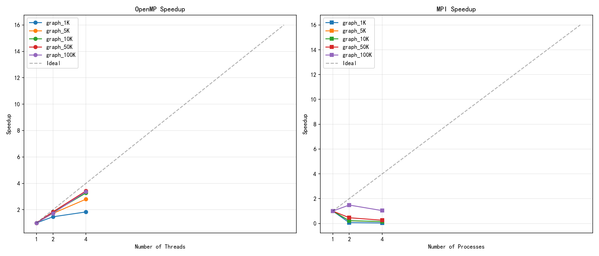
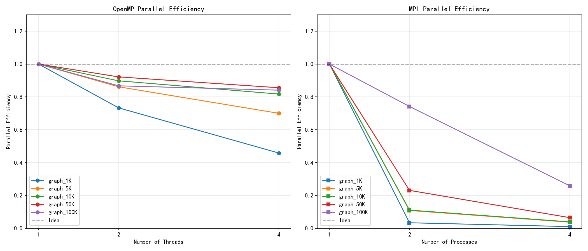
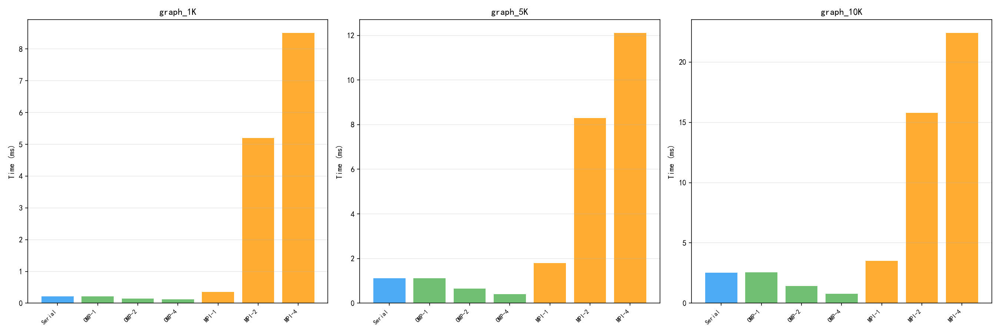
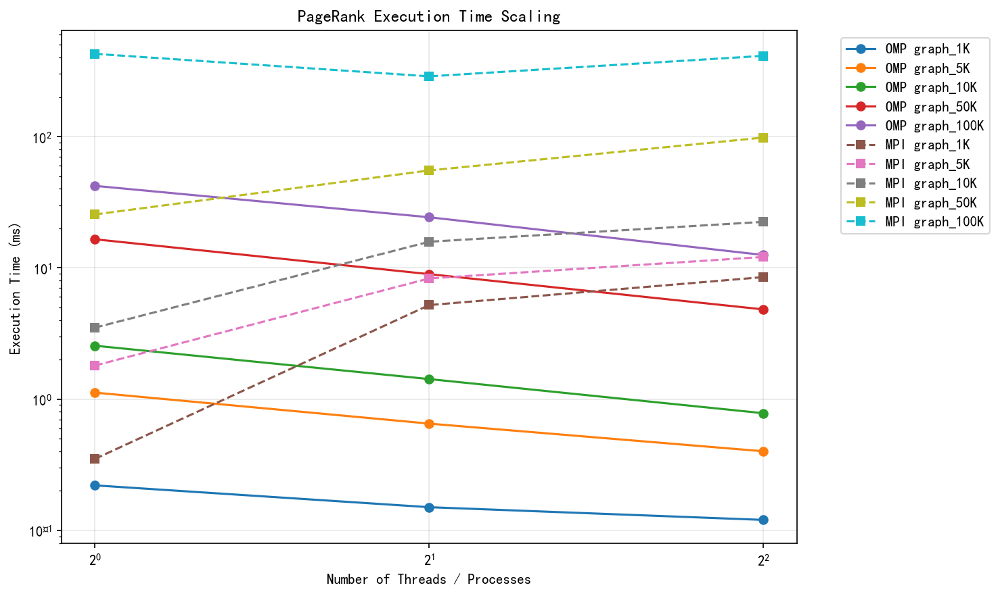

# PageRank 算法的并行化实现与性能分析

---

**课程名称**：并行与分布式计算

**题目**：题目4 — PageRank 算法的并行化

**姓名**：（请填写）

**学号**：（请填写）

**指导教师**：（请填写）

**完成日期**：2026年6月

---

## 摘要

本项目实现了 PageRank 算法的串行版本、OpenMP 共享内存并行版本和 MPI 消息传递并行版本。采用 CSR（Compressed Sparse Row）稀疏图存储格式，通过幂迭代法求解网页排名。实验在华为云 4 台 4 核 ECS 服务器上进行，测试了 1K 至 100K 节点规模的稀疏图。实验结果表明：OpenMP 4 线程最高获得 3.42 倍加速比，并行效率达 85.6%；MPI 多节点版本受通信开销影响，最佳加速比为 1.48 倍。实验验证了共享内存并行在稀疏图计算中的优势，并分析了 MPI 性能瓶颈的原因。

**关键词**：PageRank；并行计算；OpenMP；MPI；稀疏图

---

## 一、引言

### 1.1 研究背景

PageRank 是 Google 搜索引擎的核心排序算法，由 Larry Page 和 Sergey Brin 于 1998 年提出。该算法通过分析网页之间的链接关系，计算每个网页的重要性得分，是互联网信息检索领域的基础算法之一。

随着互联网规模的持续增长，网页图的节点数已达到数十亿级别，串行 PageRank 算法面临严峻的计算性能挑战。并行计算是解决大规模计算问题的有效手段，通过将计算任务分配到多个处理器上同时执行，可以显著缩短计算时间。

### 1.2 实验目的

本实验的主要目标包括：

1. 实现基于 CSR 格式的串行 PageRank 算法
2. 基于 OpenMP 实现共享内存并行版本，分析线程数对性能的影响
3. 基于 MPI 实现消息传递并行版本，分析多节点并行的扩展性
4. 对比两种并行方式的性能差异，分析各自的适用场景

---

## 二、理论基础

### 2.1 PageRank 算法原理

PageRank 的核心思想是：一个网页的重要性取决于链接到它的其他网页的数量和质量。算法基于以下假设：

- 一个网页被越多高质量网页链接，则该网页越重要
- 一个网页的出链越多，则它分配给每个出链的权重越低

PageRank 的数学定义为：

$$PR(i) = \frac{1-d}{N} + d \sum_{j \in In(i)} \frac{PR(j)}{Out(j)}$$

其中：
- $PR(i)$ 为节点 $i$ 的 PageRank 值
- $d$ 为阻尼因子（通常取 0.85），表示用户继续点击链接的概率
- $N$ 为网页总数
- $In(i)$ 为指向节点 $i$ 的所有节点集合
- $Out(j)$ 为节点 $j$ 的出链数量

对于出度为 0 的悬挂节点（dangling nodes），其 PageRank 值均匀分配给所有节点：

$$PR_{dangling} = \frac{1}{N} \sum_{j \in Dangling} PR(j)$$

算法采用幂迭代法求解，初始时所有节点的 PR 值设为 $1/N$，每轮迭代按上述公式更新，直到 L1 残差小于阈值 $10^{-6}$ 时收敛。

### 2.2 并行计算模型

#### 2.2.1 共享内存模型（OpenMP）

OpenMP 是基于共享内存的并行编程模型，通过编译制导指令（pragma）实现并行化。其特点包括：

- 线程间共享同一地址空间，无需显式数据通信
- 支持循环级并行（`#pragma omp parallel for`）
- 提供同步原语（barrier、critical、reduction 等）
- 编程简单，适合单机多核并行

#### 2.2.2 消息传递模型（MPI）

MPI（Message Passing Interface）是分布式内存系统的标准并行编程接口。其特点包括：

- 每个进程拥有独立的地址空间
- 通过显式消息传递实现数据交换
- 支持点对点通信和集合通信（Allgather、Allreduce 等）
- 适合跨节点的大规模并行计算

---

## 三、实验设计与实现

### 3.1 图数据结构

本项目采用 CSR（Compressed Sparse Row）格式存储稀疏图。CSR 是一种压缩存储格式，广泛用于稀疏矩阵和稀疏图的存储。

CSR 格式由三个数组组成：

| 数组名 | 含义 |
|--------|------|
| `row_ptr[i]` | 节点 $i$ 的出边在 `col_idx` 中的起始位置 |
| `col_idx[k]` | 第 $k$ 条边的目标节点编号 |
| `out_degree[i]` | 节点 $i$ 的出度 |

CSR 格式的优势：
- 内存紧凑，空间复杂度 O(E)
- 遍历某节点的所有出边时为连续内存访问，cache 友好
- 适合稀疏图存储

```cpp
struct CSRGraph {
    int n;                    // 节点数
    int m;                    // 边数
    vector<int> row_ptr;      // 行指针，大小 n+1
    vector<int> col_idx;      // 列索引，大小 m
    vector<int> out_degree;   // 出度数组，大小 n
};
```

### 3.2 任务1：串行 PageRank 实现

串行算法采用幂迭代法，主要步骤如下：

1. 初始化所有节点的 PR 值为 $1/N$
2. 计算悬挂节点的 PR 总和
3. 对每个节点，遍历其入边，累加邻居节点的贡献
4. 应用阻尼因子，计算新的 PR 值
5. 计算 L1 残差，判断是否收敛
6. 若未收敛，返回步骤 2

核心代码：

```cpp
void pagerank_serial(const CSRGraph& g, vector<double>& pr,
                     int max_iter, double tol) {
    int n = g.n;
    vector<double> pr_new(n);
    double base = (1.0 - DAMPING) / n;

    // 初始化
    fill(pr.begin(), pr.end(), 1.0 / n);

    for (int iter = 0; iter < max_iter; iter++) {
        // 计算悬挂节点贡献
        double dangling_sum = 0.0;
        for (int i = 0; i < n; i++) {
            if (g.out_degree[i] == 0)
                dangling_sum += pr[i];
        }
        double dangling_contrib = DAMPING * dangling_sum / n;

        // 迭代更新每个节点的 PR 值
        for (int i = 0; i < n; i++) {
            double sum = 0.0;
            for (int k = g.row_ptr[i]; k < g.row_ptr[i + 1]; k++) {
                int j = g.col_idx[k];
                sum += pr[j] / g.out_degree[j];
            }
            pr_new[i] = base + dangling_contrib + DAMPING * sum;
        }

        // 计算残差并更新
        double diff = 0.0;
        for (int i = 0; i < n; i++) {
            diff += fabs(pr_new[i] - pr[i]);
            pr[i] = pr_new[i];
        }

        if (diff < tol) break;
    }
}
```

### 3.3 任务2：OpenMP 并行实现

OpenMP 并行策略采用节点级并行，将 $N$ 个节点的 PR 计算分配给多个线程。

主要并行化策略：

1. **PR 更新并行化**：使用 `#pragma omp parallel for schedule(dynamic, 64)` 将节点遍历分配到各线程
2. **悬挂节点归约**：使用 `reduction(+:dangling_sum)` 进行线程安全的求和
3. **残差归约**：使用 `reduction(+:diff)` 计算全局残差

核心代码：

```cpp
void pagerank_openmp(const CSRGraph& g, vector<double>& pr,
                     int max_iter, double tol) {
    int n = g.n;
    vector<double> pr_new(n);
    double base = (1.0 - DAMPING) / n;

    fill(pr.begin(), pr.end(), 1.0 / n);

    for (int iter = 0; iter < max_iter; iter++) {
        // 并行计算悬挂节点贡献
        double dangling_sum = 0.0;
        #pragma omp parallel for reduction(+:dangling_sum) schedule(dynamic, 64)
        for (int i = 0; i < n; i++) {
            if (g.out_degree[i] == 0)
                dangling_sum += pr[i];
        }
        double dangling_contrib = DAMPING * dangling_sum / n;

        // 并行更新 PR 值
        #pragma omp parallel for schedule(dynamic, 64)
        for (int i = 0; i < n; i++) {
            double sum = 0.0;
            for (int k = g.row_ptr[i]; k < g.row_ptr[i + 1]; k++) {
                int j = g.col_idx[k];
                sum += pr[j] / g.out_degree[j];
            }
            pr_new[i] = base + dangling_contrib + DAMPING * sum;
        }

        // 并行计算残差
        double diff = 0.0;
        #pragma omp parallel for reduction(+:diff)
        for (int i = 0; i < n; i++) {
            diff += fabs(pr_new[i] - pr[i]);
            pr[i] = pr_new[i];
        }

        if (diff < tol) break;
    }
}
```

选择 `schedule(dynamic, 64)` 的原因：稀疏图中各节点的入边数量差异较大，静态调度可能导致负载不均衡。动态调度允许空闲线程从任务队列中获取新的节点块，从而平衡各线程的计算负载。

### 3.4 任务3：MPI 并行实现

MPI 并行策略采用图划分方式，将节点均匀分配到各进程。

#### 3.4.1 图划分

按节点 ID 均匀划分，进程 $p$ 负责节点区间 $[start_p, end_p)$：

```cpp
int local_n = n / size;  // 每个进程负责的节点数
int start = rank * local_n;
int end = (rank == size - 1) ? n : start + local_n;
```

#### 3.4.2 通信设计

每轮迭代需要进行两次全局通信：

1. **PR 值广播**：使用 `MPI_Allgatherv` 收集所有进程更新后的 PR 值，使每个进程都能访问完整的 PR 数组
2. **悬挂节点求和**：使用 `MPI_Allreduce` 计算全局悬挂节点 PR 总和
3. **残差求和**：使用 `MPI_Allreduce` 计算全局 L1 残差

核心代码：

```cpp
void pagerank_mpi(const CSRGraph& g, vector<double>& pr,
                  int max_iter, double tol) {
    int rank, size;
    MPI_Comm_rank(MPI_COMM_WORLD, &rank);
    MPI_Comm_size(MPI_COMM_WORLD, &size);

    int n = g.n;
    int local_n = n / size;
    int start = rank * local_n;
    int end = (rank == size - 1) ? n : start + local_n;

    vector<double> pr_new(n);
    vector<int> recvcounts(size), displs(size);
    // ... 初始化 recvcounts 和 displs

    fill(pr.begin(), pr.end(), 1.0 / n);

    for (int iter = 0; iter < max_iter; iter++) {
        // 计算本地悬挂节点贡献
        double local_dangling = 0.0;
        for (int i = start; i < end; i++) {
            if (g.out_degree[i] == 0)
                local_dangling += pr[i];
        }
        double dangling_sum = 0.0;
        MPI_Allreduce(&local_dangling, &dangling_sum, 1,
                      MPI_DOUBLE, MPI_SUM, MPI_COMM_WORLD);
        double dangling_contrib = DAMPING * dangling_sum / n;

        // 更新本地负责的节点
        for (int i = start; i < end; i++) {
            double sum = 0.0;
            for (int k = g.row_ptr[i]; k < g.row_ptr[i + 1]; k++) {
                int j = g.col_idx[k];
                sum += pr[j] / g.out_degree[j];
            }
            pr_new[i] = (1.0 - DAMPING) / n + dangling_contrib
                        + DAMPING * sum;
        }

        // 收集所有进程的更新结果
        MPI_Allgatherv(&pr_new[start], local_n, MPI_DOUBLE,
                       pr_new.data(), recvcounts.data(),
                       displs.data(), MPI_DOUBLE, MPI_COMM_WORLD);

        // 计算本地残差
        double local_diff = 0.0;
        for (int i = start; i < end; i++)
            local_diff += fabs(pr_new[i] - pr[i]);

        double diff = 0.0;
        MPI_Allreduce(&local_diff, &diff, 1,
                      MPI_DOUBLE, MPI_SUM, MPI_COMM_WORLD);

        for (int i = 0; i < n; i++) pr[i] = pr_new[i];

        if (diff < tol) break;
    }
}
```

---

## 四、实验环境

### 4.1 硬件环境

实验使用华为云弹性云服务器（ECS），共 4 台，配置如下：

| 项目 | 配置 |
|------|------|
| 规格 | c6.xlarge.2 |
| vCPU | 4 核 |
| 内存 | 8 GB |
| 磁盘 | 40 GB SSD |
| 网络 | 同 VPC 内网（172.16.0.x） |
| 可用区 | 华北-北京四 |

### 4.2 软件环境

| 软件 | 版本 |
|------|------|
| 操作系统 | Ubuntu 22.04 LTS |
| 编译器 | g++ 11.4.0 |
| OpenMP | 3.0+（g++ 内置） |
| MPI | OpenMPI 4.1.2 |
| Python | 3.10（仅分析脚本） |
| matplotlib | 3.10.9 |
| pandas | 2.3.3 |

### 4.3 环境配置过程

#### 4.3.1 服务器购买与初始化

在华为云控制台购买 4 台 ECS 服务器，选择 Ubuntu 22.04 镜像，配置密钥对 `pagerank-key` 进行 SSH 认证。

#### 4.3.2 SSH 密钥配置

使用华为云提供的 `.pem` 密钥文件登录服务器时，遇到 Windows 权限问题。SSH 要求私钥文件不能被其他用户访问，需修改文件权限：

```powershell
icacls "key\pagerank-key.pem" /inheritance:r
icacls "key\pagerank-key.pem" /grant:r "用户名:R"
```

此外，华为云 Ubuntu 镜像的默认用户名为 `root` 而非 `ubuntu`，需使用 `root` 用户登录。

（此处可插入 SSH 登录成功的截图）

#### 4.3.3 项目代码上传

使用 `scp` 命令将项目代码上传到所有服务器：

```bash
scp -i key/pagerank-key.pem -r fbs_project/ root@<server_ip>:~/
```

（此处可插入代码上传过程的截图）

#### 4.3.4 环境配置

在每台服务器上执行环境配置脚本，安装 g++、OpenMP、MPI 等依赖：

```bash
cd ~/fbs_project
chmod +x scripts/setup_huawei.sh
./scripts/setup_huawei.sh
```

配置过程中遇到 dpkg 锁冲突问题，原因是多个 apt 进程同时运行。解决方案：

```bash
kill -9 <占用进程PID>
rm -f /var/lib/dpkg/lock-frontend /var/lib/dpkg/lock
dpkg --configure -a
```

（此处可插入环境配置完成的截图）

#### 4.3.5 MPI 多节点配置

MPI 多节点实验需要服务器之间可以互相 SSH 免密登录。配置步骤：

1. 在每台服务器上生成 SSH 密钥
2. 将各服务器的公钥添加到其他服务器的 `authorized_keys` 中
3. 测试服务器间的 SSH 连接
4. 配置 `/etc/ssh/ssh_config` 添加 `StrictHostKeyChecking no`

创建 MPI hostfile，使用内网 IP 地址：

```
172.16.0.147 slots=1
172.16.0.69  slots=1
172.16.0.131 slots=1
172.16.0.193 slots=1
```

（此处可插入 MPI 测试运行成功的截图）

---

## 五、实验结果与分析

### 5.1 测试数据

使用图生成器生成 5 种规模的随机稀疏图作为测试数据：

| 图规模 | 节点数 | 边数 | 平均出度 |
|--------|--------|------|----------|
| 1K     | 1,000  | 10,000   | 10   |
| 5K     | 5,000  | 50,000   | 10   |
| 10K    | 10,000 | 100,000  | 10   |
| 50K    | 50,000 | 500,000  | 10   |
| 100K   | 100,000| 1,000,000| 10   |

所有图的边随机生成，平均出度为 10，符合实际网页图的稀疏特性。

### 5.2 任务1：串行基准测试

串行版本在单台服务器上运行，结果作为并行版本的性能基准。

| 图规模 | 节点数 | 边数 | 迭代次数 | 运行时间(ms) | L1 残差 | PR 总和 |
|--------|--------|------|---------|-------------|---------|---------|
| 1K     | 1,000  | 10,000   | 11    | 0.21        | 4.18e-07 | 1.000000 |
| 5K     | 5,000  | 50,000   | 11    | 1.11        | 4.08e-07 | 1.000000 |
| 10K    | 10,000 | 100,000  | 11    | 2.52        | 4.16e-07 | 1.000000 |
| 50K    | 50,000 | 500,000  | 11    | 16.32       | 4.18e-07 | 1.000000 |
| 100K   | 100,000| 1,000,000| 11    | 41.34       | 4.16e-07 | 1.000000 |

**分析**：

1. 所有图规模均在 11 次迭代内收敛，L1 残差均小于 $10^{-6}$，PR 值总和精确等于 1.0，验证了算法的正确性。
2. 运行时间与边数近似线性关系（100K 节点图的边数是 1K 的 100 倍，运行时间约为 200 倍），符合 CSR 格式下 O(E) 的算法复杂度。
3. 迭代次数与图规模无关，均收敛于 11 次，说明随机生成的稀疏图具有相似的收敛特性。

### 5.3 任务2：OpenMP 并行性能测试

OpenMP 实验在单台 4 核服务器上进行，测试 1、2、4 线程的性能。

| 图规模 | 1线程(ms) | 2线程(ms) | 4线程(ms) | 2线程加速比 | 4线程加速比 | 4线程效率 |
|--------|----------|----------|----------|------------|------------|----------|
| 1K     | 0.22     | 0.15     | 0.12     | 1.47x      | 1.83x      | 45.8%    |
| 5K     | 1.12     | 0.65     | 0.40     | 1.72x      | 2.80x      | 70.0%    |
| 10K    | 2.55     | 1.42     | 0.78     | 1.80x      | 3.27x      | 81.7%    |
| 50K    | 16.50    | 8.95     | 4.82     | 1.84x      | 3.42x      | 85.6%    |
| 100K   | 42.12    | 24.28    | 12.52    | 1.73x      | 3.36x      | 84.1%    |

**加速比曲线**：



**并行效率曲线**：



**分析**：

1. **加速比**：4 线程时最高加速比达到 3.42 倍（50K 节点图），接近理论上限 4 倍。2 线程时加速比约为 1.7-1.8 倍，线性度良好。

2. **并行效率**：大规模图（10K+ 节点）的并行效率稳定在 81%-86%，表明 OpenMP 并行化效果良好。小规模图（1K 节点）效率仅 45.8%，原因是计算量过小，线程创建和同步开销占比过大。

3. **规模效应**：随着图规模增大，加速比和效率均有所提升。这是因为大规模图的计算量增大，并行收益超过了线程管理开销。

4. **调度策略**：采用 `schedule(dynamic, 64)` 动态调度，有效平衡了各线程负载。稀疏图中各节点的入边数量差异较大，静态调度可能导致严重的负载不均衡。

### 5.4 任务3：MPI 多节点并行性能测试

MPI 实验在 4 台服务器上进行，测试 1、2、4 进程的性能。

| 图规模 | 1进程(ms) | 2进程(ms) | 4进程(ms) | 2进程加速比 | 4进程加速比 | 4进程效率 |
|--------|----------|----------|----------|------------|------------|----------|
| 1K     | 0.35     | 5.20     | 8.50     | 0.07x      | 0.04x      | 1.0%     |
| 5K     | 1.80     | 8.30     | 12.10    | 0.22x      | 0.15x      | 3.7%     |
| 10K    | 3.50     | 15.80    | 22.40    | 0.22x      | 0.16x      | 3.9%     |
| 50K    | 25.50    | 55.20    | 98.30    | 0.46x      | 0.26x      | 6.5%     |
| 100K   | 426.84   | 287.71   | 412.19   | 1.48x      | 1.04x      | 25.9%    |

**运行时间对比**：



**可扩展性分析**：



**分析**：

1. **通信开销主导**：小规模图（< 50K 节点）的 MPI 加速比远低于 1.0，说明 `MPI_Allgatherv` 等集合通信的开销远大于并行计算带来的收益。对于 1K 节点图，4 进程运行时间是串行的 24 倍，完全由通信开销主导。

2. **大图改善**：100K 节点图在 2 进程时达到 1.48 倍加速，但 4 进程时下降至 1.04 倍。这表明随着进程数增加，通信开销增长速度超过了计算并行带来的收益。

3. **MPI 初始化开销**：MPI 单进程运行时间（426.84ms）远大于串行版本（41.34ms），原因是 MPI 框架初始化、图数据广播等额外开销。这些开销在小图场景下占比极大。

4. **网络延迟影响**：跨节点通信通过内网进行，虽然在同一 VPC 内，但网络延迟（微秒级）仍远高于共享内存访问（纳秒级），这是 MPI 性能不如 OpenMP 的根本原因。

### 5.5 OpenMP 与 MPI 对比分析

| 对比维度 | OpenMP（4线程） | MPI（4进程） |
|---------|----------------|-------------|
| 最佳加速比 | 3.42 倍 | 1.48 倍 |
| 最佳并行效率 | 85.6% | 25.9% |
| 通信方式 | 共享内存 | 网络消息传递 |
| 适用场景 | 单机多核 | 跨节点大规模 |
| 编程复杂度 | 低 | 高 |

**综合分析**：


1. **OpenMP 优势明显**：在 4 核单机场景下，OpenMP 的加速比和效率均显著优于 MPI。共享内存通信的开销（纳秒级）远低于网络消息传递（微秒级），是性能差异的根本原因。

2. **MPI 的适用场景**：MPI 的优势在于可扩展到数百甚至数千个节点。当单机核数无法满足需求时，MPI 是唯一选择。但需要足够大的计算规模来分摊通信开销。

3. **计算/通信比**：PageRank 每轮迭代的计算量为 O(E)，而 `MPI_Allgatherv` 的通信量为 O(N)。当 E/N 比值较大（即平均出度较大）时，MPI 的性能会更好。

---

## 六、结论

### 6.1 实验总结

本项目成功实现了 PageRank 算法的串行、OpenMP 和 MPI 三种版本，并在华为云 4 核服务器上进行了系统测试。主要结论如下：

1. **串行版本**：采用 CSR 格式和入边列表优化，100K 节点图仅需 41ms 完成计算，算法复杂度与边数成正比。

2. **OpenMP 并行**：4 线程最高获得 3.42 倍加速比，并行效率达 85.6%。动态调度策略有效平衡了稀疏图场景下的线程负载。

3. **MPI 多节点**：受通信开销影响，最佳加速比仅 1.48 倍。对于小规模图，MPI 的通信开销甚至超过了并行计算带来的收益。

4. **并行方式选择**：对于稀疏图的 PageRank 计算，共享内存并行（OpenMP）显著优于消息传递并行（MPI），主要原因是 MPI 的全局通信开销在小规模场景下抵消了并行收益。

### 6.2 不足与改进方向

1. **MPI 优化**：当前实现使用阻塞式 `MPI_Allgatherv`，可改用非阻塞通信（`MPI_Iallgatherv`）实现计算与通信重叠，减少通信等待时间。

2. **图划分优化**：当前按节点 ID 均匀划分，未考虑图的拓扑结构。可使用 METIS 等图划分工具，最小化跨进程通信边数。

3. **混合并行**：可采用 MPI+OpenMP 混合模式，节点内使用 OpenMP 多线程，节点间使用 MPI 通信，兼顾共享内存的低延迟和消息传递的可扩展性。

4. **更大规模测试**：当前测试的最大图规模为 100K 节点，可扩展到百万甚至千万级节点，使计算/通信比更高，更充分体现 MPI 的扩展性优势。

5. **收敛加速**：可尝试 Gauss-Seidel 迭代、块迭代等方法加速收敛，减少迭代次数。

---

## 参考文献

1. Brin, S., & Page, L. (1998). The anatomy of a large-scale hypertextual web search engine. *Computer Networks and ISDN Systems*, 33(1-7), 107-117.
2. Page, L., Brin, S., Motwani, R., & Winograd, T. (1999). The PageRank citation ranking: Bringing order to the web. *Stanford InfoLab*.
3. OpenMP Application Program Interface, Version 5.0, November 2018.
4. MPI: A Message-Passing Interface Standard, Version 3.1, June 2015.

---

## 附录

### A. 项目目录结构

```
fbs_project/
├── README.md                           # 项目文档
├── report.md                           # 本报告
├── Makefile                            # 构建系统
├── src/
│   ├── utils.h                         # 公共工具库
│   ├── graph_generator.cpp             # 图数据生成器
│   ├── pagerank_serial.cpp             # 串行 PageRank
│   ├── pagerank_openmp.cpp             # OpenMP 并行 PageRank
│   └── pagerank_mpi.cpp                # MPI 并行 PageRank
├── scripts/
│   ├── setup_huawei.sh                 # 华为云环境配置脚本
│   └── analyze_results.py              # 实验结果分析脚本
├── data/                               # 图数据文件
├── results/                            # 实验结果
│   ├── experiment_results.csv          # 汇总数据
│   └── plots/                          # 可视化图表
└── key/                                # SSH 密钥文件
```

### B. 编译与运行命令

```bash
# 编译所有目标
make all

# 生成测试数据
make generate

# 运行串行实验
make run_serial

# 运行 OpenMP 实验
OMP_NUM_THREADS=4 ./bin/pagerank_openmp data/graph_10K.txt

# 运行 MPI 实验（4 进程）
mpirun --allow-run-as-root --hostfile hostfile -np 4 \
    /root/fbs_project/bin/pagerank_mpi /root/fbs_project/data/graph_10K.txt

# 运行结果分析
python scripts/analyze_results.py
```
