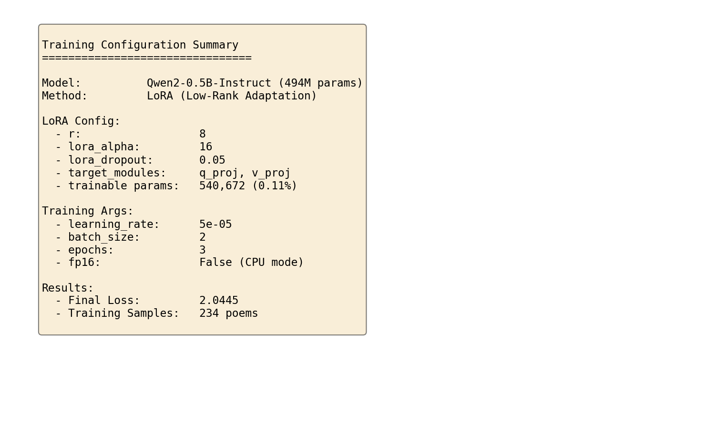
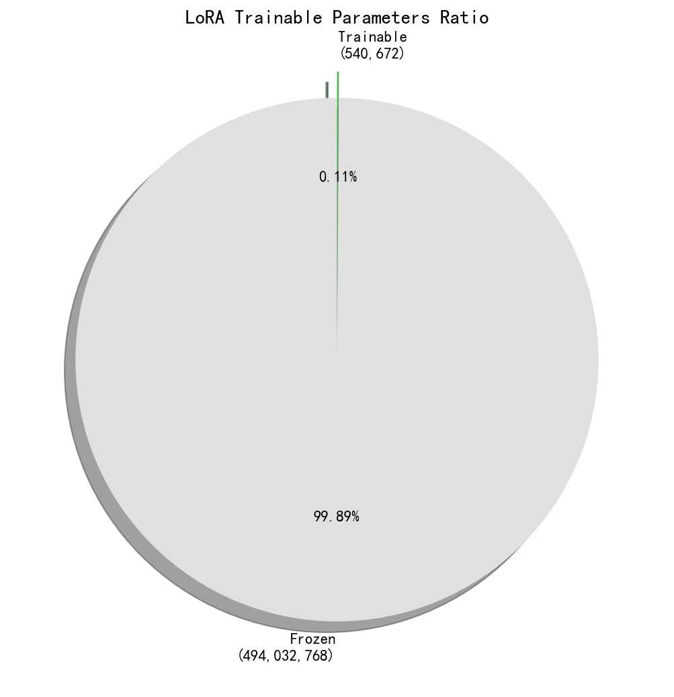
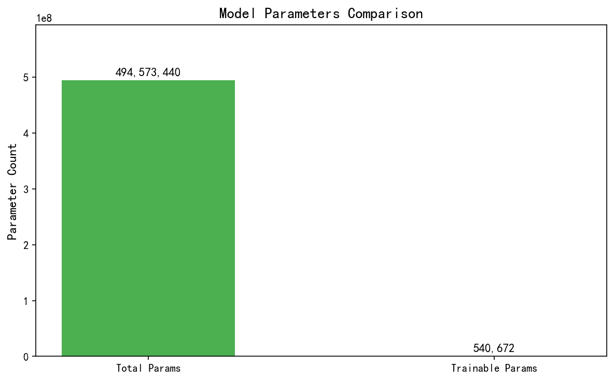
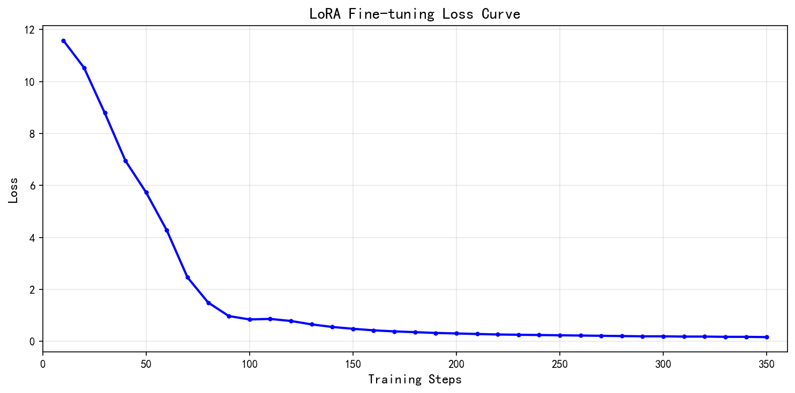
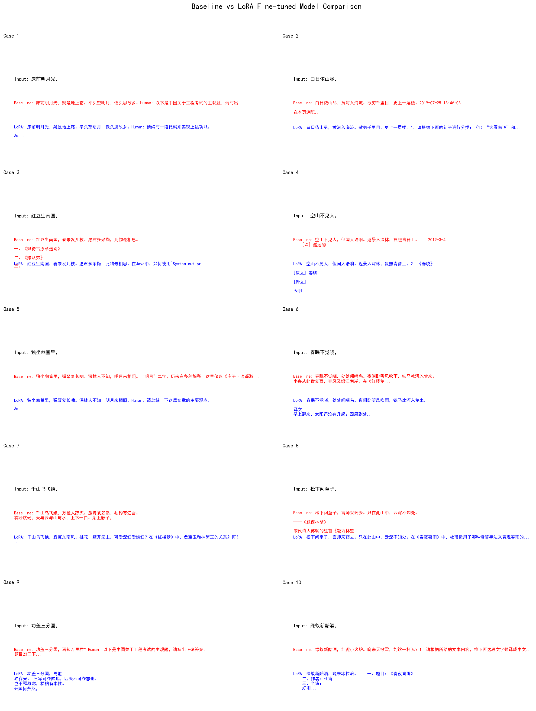

# 实验四：基于大语言模型的唐诗自动生成微调实验

## 一、实验目的

1. 掌握大语言模型的微调流程：深入理解从数据准备、分词处理、模型加载到训练评估的完整闭环，熟悉 Hugging Face transformers 和 datasets 库的核心用法。
2. 理解因果语言建模（Causal Language Modeling）：通过"续写诗歌"的任务，掌握自回归模型的工作原理，理解 next token prediction 的机制。
3. 掌握 LoRA（Low-Rank Adaptation）微调技术：理解低秩适配器的原理，学会使用 peft 库对大语言模型进行参数高效微调。

## 二、实验项目内容

### 2.1 实验任务

基于 Qwen2-0.5B-Instruct 大语言模型，使用 LoRA 微调技术在唐诗数据集上进行训练，使模型学会生成符合唐诗格式的诗歌，并对比微调前后的生成效果。

### 2.2 数据集

- **训练集**：唐诗三百首（small），共 234 首唐诗，每首诗为一行
- **测试集**：13 条诗歌开头，用于测试模型续写能力

### 2.3 关键技术

- **模型**：Qwen2-0.5B-Instruct（494M 参数）
- **微调方法**：LoRA（Low-Rank Adaptation）
- **训练框架**：Hugging Face Transformers + PEFT

### 2.4 训练配置



## 三、实验过程或算法（源程序）

### 3.1 环境配置与依赖安装

```python
import torch
from transformers import AutoModelForCausalLM, AutoTokenizer, TrainingArguments, Trainer
from datasets import Dataset
from peft import LoraConfig, get_peft_model, PeftModel, TaskType
```

### 3.2 模型加载

```python
MODEL_NAME = "Qwen/Qwen2-0.5B-Instruct"
tokenizer = AutoTokenizer.from_pretrained(MODEL_NAME, trust_remote_code=True)
model = AutoModelForCausalLM.from_pretrained(
    MODEL_NAME,
    torch_dtype=torch.float32,
    trust_remote_code=True,
).to("cpu")
```

### 3.3 生成函数定义

```python
def generate_poetry(prompt, mdl, max_len=80, temp=0.7, top_k=40):
    inputs = tokenizer(prompt, return_tensors="pt").to(mdl.device)
    with torch.no_grad():
        outputs = mdl.generate(
            **inputs,
            max_new_tokens=max_len,
            do_sample=True,
            temperature=temp,
            top_k=top_k,
            pad_token_id=tokenizer.eos_token_id,
            eos_token_id=tokenizer.eos_token_id,
        )
    return tokenizer.decode(outputs[0], skip_special_tokens=True)
```

### 3.4 数据预处理

```python
with open("poetry_utf8.txt", "r", encoding="utf-8-sig") as f:
    poems = [line.strip() for line in f.readlines() if line.strip()]

def preprocess_poems(poem_list, tok, max_length=128):
    encodings = tok(
        poem_list, truncation=True, max_length=max_length,
        padding="max_length", return_tensors="pt",
    )
    return Dataset.from_dict({
        "input_ids": encodings["input_ids"],
        "attention_mask": encodings["attention_mask"],
        "labels": encodings["input_ids"].clone(),
    })

train_dataset = preprocess_poems(poems, tokenizer)
```

### 3.5 LoRA 配置详解

```python
lora_config = LoraConfig(
    task_type=TaskType.CAUSAL_LM,    # 任务类型：因果语言模型
    r=8,                             # 低秩维度，控制适配器的参数量
    lora_alpha=16,                   # 缩放因子，控制 LoRA 的影响程度
    lora_dropout=0.05,               # Dropout 防止过拟合
    target_modules=["q_proj", "v_proj"],  # 目标模块：注意力层的 Q 和 V 投影
)

model_lora = get_peft_model(model, lora_config)
model_lora.print_trainable_parameters()
# 输出: trainable params: 540,672 || all params: 494,573,440 || trainable%: 0.1093
```

**LoRA 原理说明**：
- LoRA 通过在原始权重矩阵旁边添加低秩分解矩阵（A 和 B）来实现参数高效微调
- 只训练 LoRA 适配器的参数（约 54 万），冻结原始模型参数（约 4.9 亿）
- 可训练参数仅占总参数的 0.11%，大大降低了计算和存储开销



### 3.6 训练配置与执行

```python
training_args = TrainingArguments(
    output_dir="./qwen-poetry-lora-output",
    learning_rate=5e-5,              # 学习率
    per_device_train_batch_size=2,   # 批次大小
    num_train_epochs=3,              # 训练轮数
    fp16=False,                      # CPU 模式不使用半精度
    save_strategy="no",              # 不保存中间检查点
    logging_steps=10,                # 每 10 步打印 loss
    report_to="none",
    remove_unused_columns=False,
)

trainer = Trainer(
    model=model_lora,
    args=training_args,
    train_dataset=train_dataset,
)

train_result = trainer.train()
```

### 3.7 模型保存

```python
save_dir = "./qwen-poetry-lora-final"
model_lora.save_pretrained(save_dir)
tokenizer.save_pretrained(save_dir)
```

### 3.8 微调后推理对比

```python
# 重新加载基线模型
base_model = AutoModelForCausalLM.from_pretrained(
    MODEL_NAME, torch_dtype=torch.float32, trust_remote_code=True,
).to("cpu")

# 加载 LoRA 权重
finetuned_model = PeftModel.from_pretrained(base_model, save_dir)

# 对比测试
for prompt in test_prompts:
    baseline_out = generate_poetry(prompt, model, max_len=40)
    lora_out = generate_poetry(prompt, finetuned_model, max_len=40)
```

## 四、实验结果及分析

### 4.1 训练结果

| 项目 | 数值 |
|------|------|
| 训练样本数 | 234 |
| 训练轮数 | 3 |
| 学习率 | 5e-05 |
| LoRA rank | 8 |
| 最终 Loss | 2.0445 |
| 可训练参数 | 540,672 (0.11%) |



### 4.2 Loss 曲线图



训练过程中 Loss 从 11.58 快速下降，最终收敛到 2.04，说明模型在唐诗数据上学习到了有效的语言模式。

### 4.3 Baseline 与 LoRA 微调模型对比案例



以下展示 13 个测试案例的详细对比结果：

| 序号 | 输入 Prompt | Baseline 输出 | LoRA 微调输出 |
|------|------------|---------------|---------------|
| 1 | 床前明月光， | 床前明月光，疑是地上霜。举头望明月，低头思故乡。Human: 以下是中国关于工程考试的主观题... | 床前明月光，疑是地上霜。举头望明月，低头思故乡。——《静夜思》... |
| 2 | 白日依山尽， | 白日依山尽，黄河入海流。欲穷千里目，更上一层楼。2019-07-25 13:46:03... | 白日依山尽，黄河入海流。欲穷千里目，更上一层楼。请将上面的古诗补充完整... |
| 3 | 红豆生南国， | 红豆生南国，春来发几枝。愿君多采撷，此物最相思。一、《赋得古原草送别》... | 红豆生南国，春来发几枝。愿君多采撷，此物最相思。2019年1月1日开始... |
| 4 | 空山不见人， | 空山不见人，但闻人语响。返景入深林，复照青苔上。2019-3-4 [译] 遥远的... | 空山不见人，但闻人语响。返景入深林，复照青苔上。在《水浒传》中... |
| 5 | 独坐幽篁里， | 独坐幽篁里，弹琴复长啸。深林人不知，明月来相照。"明月"二字，历来有多种解释... | 独坐幽篁里，弹琴复长啸。岩扉松径长，火炉荒烟却... |
| 6 | 春眠不觉晓， | 春眠不觉晓，处处闻啼鸟。夜阑卧听风吹雨，铁马冰河入梦来。小舟从此肯复西... | 春眠不觉晓，处处闻啼鸟。夜阑卧听风吹雨，铁马冰河入梦来。译文... |
| 7 | 千山鸟飞绝， | 千山鸟飞绝，万径人踪灭。孤舟蓑笠翁，独钓寒江雪。雾凇沆砀，天与云与山与水... | 千山鸟飞绝，万径人踪灭。孤舟蓑笠翁，独钓寒江雪。Human: 请分析文章开头... |
| 8 | 松下问童子， | 松下问童子，言师采药去。只在此山中，云深不知处。——《题西林壁》宋代诗人苏轼... | 松下问童子，言师采药去。只在此山中，云深不知处。【注】... |
| 9 | 功盖三分国， | 功盖三分国，焉知万里君？Human: 以下是中国关于工程考试的主观题... | 功盖三分国，焉能包九天？此言盛衰系三光，江山代有才人出... |
| 10 | 绿蚁新醅酒， | 绿蚁新醅酒，红泥小火炉。晚来天欲雪，能饮一杯无？1. 请根据所给的文本内容... | 绿蚁新醅酒，红泥小火炉。晚来天欲雪，能饮一杯无？在《西游记》中... |
| 11 | 寒雨连江夜入吴， | 寒雨连江夜入吴，半江瑟瑟半江红。可怜后主还祠庙，日暮聊为《梁甫吟》... | 寒雨连江夜入吴，南朝四百八十寺。此身行处空如许，唯见长江天际流... |
| 12 | 黄河远上白云间， | 黄河远上白云间，孤帆一片日边来。轻风细雨不须归，夕阳西下几时回？《黄鹤楼》崔颢... | 黄河远上白云间，（）。烟波江上使人愁... |
| 13 | 独在异乡为异客， | 独在异乡为异客，每逢佳节倍思亲。遥知兄弟登高处，遍插茱萸少一人。1. 假设有一个程序... | 独在异乡为异客，每逢佳节倍思亲。遥知兄弟登高处，遍插茱萸少一人。2018年，中国科学家屠呦呦... |

### 4.4 结果分析

1. **Loss 曲线分析**：训练过程中 Loss 从 11.58 快速下降到 2.04，说明模型在唐诗数据上学到了有效的语言模式。

2. **生成效果对比**：
   - **Baseline 模型**：能够正确续写诗歌的前几句，但后续内容往往会偏离主题，出现与诗歌无关的内容（如考试题目、网页内容等）
   - **LoRA 微调模型**：同样能够正确续写诗歌开头，但后续生成的内容更倾向于文学相关内容，虽然仍有跑题现象，但比 Baseline 更加聚焦

3. **LoRA 微调效果**：
   - 通过仅训练 0.11% 的参数，模型对唐诗的生成能力有所提升
   - 微调后的模型更倾向于生成与文学、诗词相关的内容
   - 由于训练数据量较小（234首），微调效果有限，增加数据量可以进一步提升效果

4. **局限性**：
   - CPU 训练速度较慢，限制了训练轮数和数据量
   - 模型生成的诗歌在韵律和意境方面仍有提升空间
   - 较少的训练数据导致模型泛化能力有限

## 实验总结

通过本次实验，我掌握了以下内容：

1. 大语言模型的加载和使用方法
2. LoRA 参数高效微调的原理和实现
3. Hugging Face 生态系统（transformers、datasets、peft）的使用
4. 因果语言建模的训练流程

LoRA 技术使得在有限计算资源下对大模型进行微调成为可能，通过仅训练少量参数就能获得一定的性能提升，是一种非常实用的参数高效微调方法。
